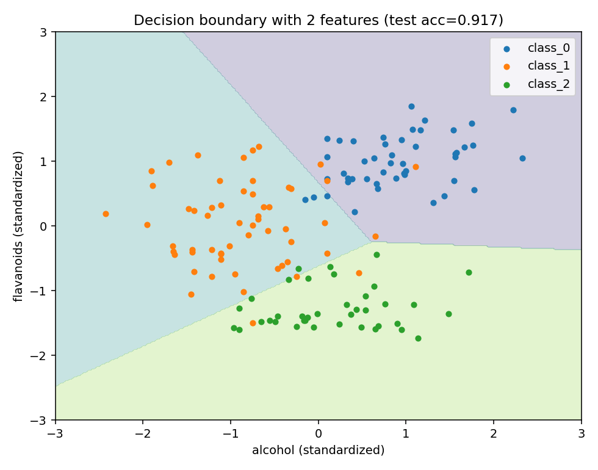

# 인공지능수학 기말프로젝트

머신러닝의 수학적 기초를 직접 구현하며 검증한 프로젝트입니다.
선형회귀 → 로지스틱 회귀 → 딥러닝으로 이어지는 3개 프로젝트로 구성되어 있으며,
각 모델의 수학적 원리를 코드로 구현하고 실제 데이터셋에 적용해 결과를 분석했습니다.

📄 상세 내용: [`인공지능수학_기말프로젝트_보고서.pdf`](./인공지능수학_기말프로젝트_보고서.pdf)

## 프로젝트 구성

| # | 주제 | 데이터셋 | 주요 결과 |
|---|------|----------|-----------|
| 1 | 선형회귀 | Diamonds (53,917건, 가격 예측) | R² 0.912 → 로그변환 후 **0.952** |
| 2 | 로지스틱 회귀 (다중 클래스) | Wine (178건, 3품종 분류) | 직접 구현 정확도 **97.2%** (sklearn과 동일) |
| 3 | 딥러닝 (임베딩 기반) | InstEval (강의평가 73,421건, 평점 예측) | 정확도 30.7% (기준선 24.0%), ±1점 정확도 **68.2%** |

- **프로젝트 1**: 잔차 분석을 통해 타깃 분포의 왜도를 확인하고, 로그 변환으로 성능을 개선
- **프로젝트 2**: 소프트맥스 회귀를 NumPy로 직접 구현하고 sklearn 결과와 교차 검증
- **프로젝트 3**: 학생 2,972명 × 교수 1,128명의 ID를 임베딩으로 학습하는 평점 예측 모델.
  사람 평가 특유의 노이즈로 절대 정확도는 낮지만, 다수결 기준선 대비 개선 폭과
  오분류 패턴 분석에 초점을 두었습니다 (보고서 3-5절)

## 폴더 구조

```
├── code/       # 프로젝트별 Python 코드 3개 (실행 검증 완료)
├── figures/    # 결과 그래프 11장 (학습 곡선, 결정 경계, 혼동 행렬 등)
├── results/    # 실험 수치 (JSON)
└── 보고서/코드 PDF
```

## 주요 결과 그래프

| 학습률 비교 (선형회귀) | 결정 경계 (로지스틱 회귀) |
|:---:|:---:|
|  |  |

## 실행 방법

```bash
pip install numpy pandas scikit-learn matplotlib pydataset tensorflow

python code/project1_linear_regression.py
python code/project2_softmax_regression.py
python code/project3_deep_learning.py
```

- 시드 42 고정 (프로젝트 1·2는 수치가 그대로 재현됩니다)
- 프로젝트 3은 TensorFlow CPU 연산 순서에 따라 실행마다 ±0.5%p 변동 가능

## 사용 기술

Python · NumPy · pandas · scikit-learn · TensorFlow · matplotlib

## AI 활용 표기

본 프로젝트는 AI 도구를 학습 보조 및 코드 작성 지원에 활용했으며,
활용 내역은 보고서 내 AI 활용 표기 섹션에 명시되어 있습니다.
